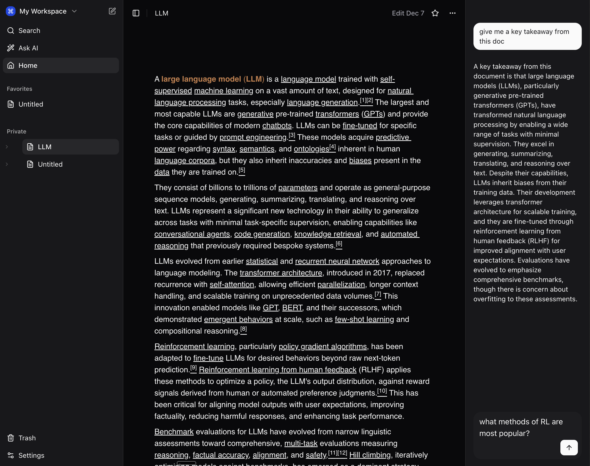

<a href="https://docufy-oss.vercel.app">
  
  <h1 align="center">Docufy</h1>
</a>

<p align="center">
  AI Document Management Platform Built with TanStack Start, TanStack AI and Convex.
</p>

> **⚠️ WARNING: This project is currently in early development.**  

<p align="center">
  <a href="#features"><strong>Features</strong></a> ·
  <a href="#model-providers"><strong>Model providers</strong></a> ·
  <a href="#deploy-your-own"><strong>Deploy your own</strong></a> ·
  <a href="#running-locally"><strong>Running locally</strong></a>
</p>
<br/>

## Features

- [TanStack Start](https://tanstack.com/start/latest)
  - File-based routing, type-safe from server to client
  - Built on Vite for a lightning-fast HMR development experience
- [TanStack AI](https://tanstack.com/ai/latest)
  - AI integration with OpenAI adapter
  - Server-sent events for streaming responses
- [Tiptap v3](https://tiptap.dev/)
  - Modern rich text editor framework
  - Extensible with custom extensions (code blocks, emojis, slash commands, etc.)
- [Convex](https://www.convex.dev/)
  - Collaborative editing with [ProseMirror Sync from Convex](https://www.convex.dev/components/prosemirror-sync)
  - [Full-text search](https://docs.convex.dev/search/text-search) for document content
- [Better Auth](https://www.better-auth.com/)
  - Secure authentication with [Better Auth for Convex](https://labs.convex.dev/better-auth)
  - GitHub OAuth integration
- [Shadcn/UI](https://ui.shadcn.com)
  - Styling with [Tailwind CSS](https://tailwindcss.com)
  - Component primitives from [Radix UI](https://radix-ui.com) for accessibility and flexibility

## Model provider

This app ships with [OpenAI](https://openai.com/) provider as the default. However, with the [Tanstack AI](https://tanstack.com/ai/latest), you can switch LLM providers to [Anthropic](https://anthropic.com), [Ollama](https://ollama.com), [Gemini](https://cohere.com/), and [many more](https://tanstack.com/ai/latest/docs/getting-started/overview) with just a few lines of code.

- GPT-4.1 (`gpt-4.1`): Excelling in instruction following and tool calling
- GPT-4.1 mini (`gpt-4.1-mini`): Faster version designed for efficiency without compromising performance
- GPT-4.1 nano (`gpt-4.1-nano`): Most cost-effective and fastest model

## Deploy your own

You can deploy your own version of Docufy to Vercel with one click:

[](https://vercel.com/new/clone?repository-url=https%3A%2F%2Fgithub.com%2Fmurabcd%2Fdocs&env=CONVEX_DEPLOYMENT,VITE_CONVEX_URL,OPENAI_API_KEY&envDescription=Learn%20more%20about%20how%20to%20get%20the%20API%20Keys%20for%20the%20application&envLink=https%3A%2F%2Fgithub.com%2Fmurabcd%2Fdocs%2Fblob%2Fmain%2F.env.example&demo-title=Docufy&demo-description=AI-powered%20document%20management%20platform%20built%20with%20Tanstack%20Start%2C%20Tiptap%20v3%2C%20Convex%2C%20and%20OpenAI.&demo-url=https%3A%2F%2Fdocufy-oss.vercel.app)

## Running locally

You will need to use the environment variables [defined in `.env.example`](.env.example) to run Docufy. It's recommended you use [Vercel Environment Variables](https://vercel.com/docs/projects/environment-variables) for this, but a `.env` file is all that is necessary.

> Note: You should not commit your `.env` file or it will expose secrets that will allow others to control access to your various OpenAI and authentication provider accounts.

### GitHub authentication

- Set `BETTER_AUTH_SECRET`, `GITHUB_CLIENT_ID`, and `GITHUB_CLIENT_SECRET` in your Convex environment.
- For local development, configure your GitHub OAuth callback URL as `${VITE_SITE_URL}/api/auth/callback/github` so the OAuth state cookie is set and read on the same origin.

1. Install Vercel CLI: `npm i -g vercel`
2. Link local instance with Vercel and GitHub accounts (creates `.vercel` directory): `vercel link`
3. Download your environment variables: `vercel env pull`

```bash
bun install
bun dev
```

Your app should now be running on [localhost:3000](http://localhost:3000/).
